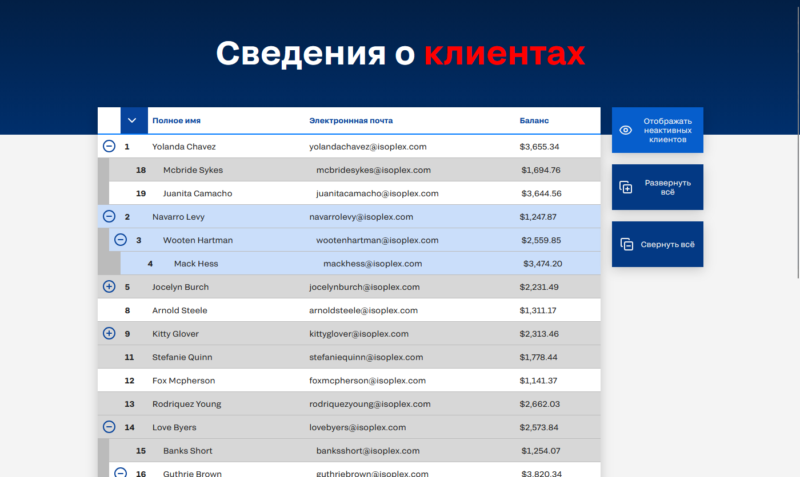

# Задача 9 — Вложенная таблица данных

(я предположил, что это данные клиентов, потому что почему бы и нет)

## Запуск:

1. [Установите Node.js и NPM](https://nodejs.org/en/download/current), если они ещё не установлены
2. Клонируйте репозиторий
3. Установите зависимости — `npm i`
4. Запуск в режиме разработки — `npm run dev`
5. Запуск сборки для прода — `npm run build`
